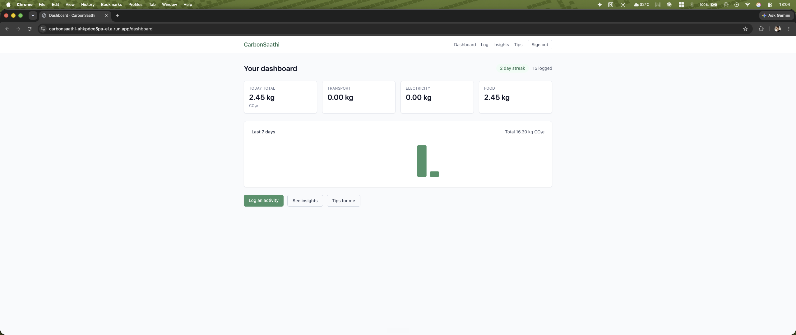
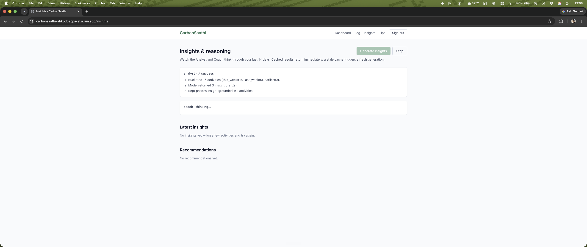
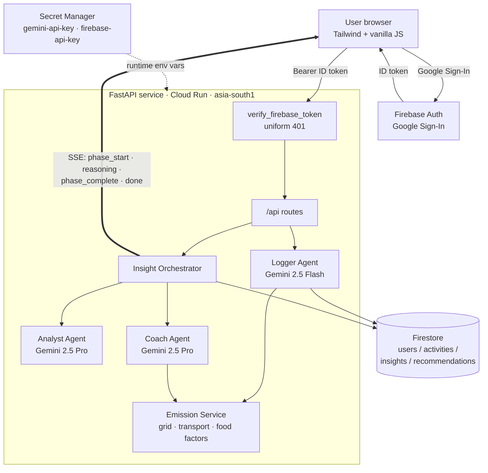
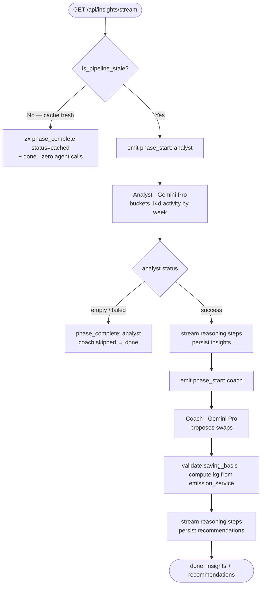

# CarbonSaathi 🌱 (कार्बन साथी)

[](https://github.com/apoorvgpt9/carbonsaathi/actions/workflows/ci.yml)
[](./LICENSE)
[](#9-testing--quality)
[](pyproject.toml)

> **Your carbon companion, not your carbon scolder.**

A personal AI companion that helps **Indian metro professionals** understand and
reduce their daily carbon footprint through **natural-language activity logging**,
**state-aware emission calculation**, and **visible AI reasoning** you can watch
unfold step by step.

**▶ Live demo:** <https://carbonsaathi-ahkpdce5pa-el.a.run.app> — sign in with any
Google account (the full journey — sign in → log → insight → recommendation — runs
end to end).

---

## Table of contents

1. [The problem & who it's for](#1-the-problem--who-its-for)
2. [Try it in 60 seconds](#2-try-it-in-60-seconds)
3. [What makes this different: visible agent reasoning](#3-what-makes-this-different-visible-agent-reasoning)
4. [Architecture](#4-architecture)
5. [The agent pipeline](#5-the-agent-pipeline)
6. [Built for India](#6-built-for-india)
7. [Tech stack & project structure](#7-tech-stack--project-structure)
8. [Security](#8-security)
9. [Testing & quality](#9-testing--quality)
10. [Run it yourself](#10-run-it-yourself)
11. [Engineering decisions (ADR)](#11-engineering-decisions-adr)
12. [Limitations](#12-limitations)
13. [Data sources & license](#13-data-sources--license)

---

## 1. The problem & who it's for

> **Problem statement:** Build an application that helps people track and reduce
> their everyday carbon footprint through simple actions and personalized insights.

Most "carbon" apps are **trackers** — passive dashboards that measure and then
guilt-trip. CarbonSaathi is a **companion** (*saathi*, साथी): it does the math,
explains its reasoning in plain language, and proposes specific swaps grounded in
real Indian emission data.

**Built for Riya / Rahul, 28** — a software engineer in a Tier‑1/Tier‑2 Indian
metro (Bengaluru, Mumbai, Pune, Hyderabad, Delhi NCR). Lives in a 2BHK with an AC
and a fridge; commutes by metro one day and a cab the next, sometimes works from
home; pays their own electricity bill; climate-aware but tracks nothing today.
The design follows from this persona: low-friction logging, no guilt-tripping copy,
specific actionable advice, and Indian context everywhere.

> Full persona, scope, and rationale: [DECISIONS.md](./DECISIONS.md) §1–§4.

---

## 2. Try it in 60 seconds

Against the [live demo](https://carbonsaathi-ahkpdce5pa-el.a.run.app):

1. **Sign in** with Google.
2. **Onboard** — pick your state (e.g. *Maharashtra*) and home profile (BHK, AC,
   fridge rating, diet). This is what makes the numbers state-specific.
3. **Log in plain English** on the *Log* page — type what you actually did:
   - `took an auto to office, about 8 km`
   - `AC ran for 6 hours last night`
   - `had chicken biryani for lunch`
   The **Logger agent** parses each into a structured activity and computes the
   emission locally from cited Indian factors.
4. **Open *Insights*** — watch the **Analyst → Coach** pipeline stream its
   reasoning live (see §3), then land on patterns + recommendations.
5. **Accept a recommendation** on the *Tips* page — it's saved to your profile.

No activity yet? The pipeline degrades gracefully — insights return an empty,
explained state rather than an error.



*Above: the dashboard — today's footprint, the IST-aligned 7-day window, and the
activity streak.*

---

## 3. What makes this different: visible agent reasoning

Almost every submission in this category shows the **final output**. CarbonSaathi
streams the **reasoning that produced it** — the Analyst's pattern-finding and the
Coach's swap logic — **step by step** over **Server-Sent Events**, while generation
is still in flight. The per-step trace is persisted on every insight and
recommendation (`agentReasoning`) so it's auditable after the fact, not just a
visual flourish.

> **Why this is the differentiator:** it turns the AI from a black box into a
> glass box. A user (or evaluator) can see *why* a recommendation was made, and the
> Coach's arithmetic is shown to come from the local factor table — not from the
> model's imagination (see §5, "Coach computes savings").



*Above: the Insights view rendering `reasoning` events as they arrive, before the
final `done` payload. Screenshot from the live deployment.*

### The stream, in the raw

`GET /api/insights/stream` is a single content-negotiated endpoint. With
`Accept: text/event-stream` it emits SSE; with `Accept: application/json` it
returns one consolidated payload. Here is the actual event shape, captured with
`curl` against a local server:

```bash
curl -N -H "Accept: text/event-stream" \
     -H "Authorization: Bearer $TOKEN" \
     http://localhost:8080/api/insights/stream
```

```text
event: phase_start
data: {"event":"phase_start","phase":"analyst"}

event: reasoning
data: {"event":"reasoning","phase":"analyst","step":"Bucketed 14 days into this_week (8 activities) and last_week (6)."}

event: reasoning
data: {"event":"reasoning","phase":"analyst","step":"Transport is 71% of this week's 19.8 kg CO2e; weekday cab rides dominate."}

event: phase_complete
data: {"event":"phase_complete","phase":"analyst","status":"success","reason":null}

event: phase_start
data: {"event":"phase_start","phase":"coach"}

event: reasoning
data: {"event":"reasoning","phase":"coach","step":"Largest controllable bucket: 8 km weekday cab commute."}

event: reasoning
data: {"event":"reasoning","phase":"coach","step":"emission_service: petrol cab 0.170 vs metro 0.031 kg/km. Computed saving = 0.139 x 8 km x 2 x 5 = 11.1 kg/week."}

event: phase_complete
data: {"event":"phase_complete","phase":"coach","status":"success","reason":null}

event: done
data: {"event":"done","insights":[...],"recommendations":[...],"analyst_status":"success","coach_status":"success"}
```

The `reasoning` step text is model-generated and varies per run; the **event
protocol** (`phase_start` → `reasoning` → `phase_complete` → `done`) and the
**phase ordering** are fixed by the orchestrator. The 80 ms inter-event pacing is
applied on the SSE path only; the JSON path skips it entirely.

> Implementation: [`app/services/orchestrator.py`](app/services/orchestrator.py)
> (pure, transport-agnostic event generator) and
> [`app/routes/insights.py`](app/routes/insights.py) (SSE/JSON adapter).

---

## 4. Architecture

Three sequential AI agents behind an async FastAPI service on Cloud Run, with all
emission arithmetic done locally and all model outputs validated before they're
trusted.



### Data model (Firestore)

```text
users/{uid}
  email, displayName, state, homeProfile{ bhk, hasAC, fridgeClass, dietary }
  onboardingComplete, createdAt, lastActive
  ├── activities/{id}      type, rawInput, structuredData, emissionKgCo2e,
  │                        confidence, emissionFactorSource, agentReasoning
  ├── insights/{id}        type, title, description, supportingActivities,
  │                        agentReasoning
  ├── recommendations/{id} type, title, expectedSavingKg, difficulty,
  │                        accepted, agentReasoning
  └── state/generation     analystStatus, coachStatus, lastCompletedAt  (staleness)
```

`agentReasoning` is the field that powers the "show your work" UI. Every
user-facing aggregation ("today", "this week", streaks) is computed in **IST**
(`Asia/Kolkata`) at read time; timestamps are stored UTC.

> Full data model and user lifecycle: [DECISIONS.md](./DECISIONS.md) §8.

---

## 5. The agent pipeline

| Agent | Model | Job | Why |
|---|---|---|---|
| **Logger** | Gemini 2.5 **Flash** | Parse free-text into a typed activity via function calling | Cheap + fast for high-frequency logging; the "simple actions" half of the PS |
| **Analyst** | Gemini 2.5 **Pro** | Find patterns/trends/milestones over a 14-day window | Higher reasoning quality for "personalized insights" |
| **Coach** | Gemini 2.5 **Pro** | Propose `swap` / `reduce` / `challenge` recommendations | The "reduce" mandate, with **computed** savings |



**Three design rules that matter here:**

- **The Coach computes savings; it never trusts the model for a number.** The model
  proposes a *typed* `saving_basis`; the agent validates it against the emission
  factor table and computes `expectedSavingKg` itself. The model can shape an
  activity, never set its carbon impact.
- **Every agent outcome is a typed discriminated union** (`success` / `empty` /
  `rejected` / `failed`). Expected failures — governance rejection, low data,
  malformed JSON — are values, not exceptions. Routes pattern-match the status to
  an HTTP response.
- **Staleness caching short-circuits the whole pipeline.** If nothing has changed
  since the last run (IST-day aligned, with empty-result TTLs), the orchestrator
  serves cached results and calls **zero** agents.

> Detail: [DECISIONS.md](./DECISIONS.md) §7, §14; build notes in
> [PROGRESS.md](./PROGRESS.md).

---

## 6. Built for India

This is the spec-alignment core. Every factor is India-specific and source-cited;
confidence tiers (`high` / `medium` / `estimated`) are visible to the user.

**Electricity — state grid factors** (kg CO₂e/kWh, CEA CO₂ Baseline Database
v19.0, 2023‑24). Same kWh, very different carbon depending on where you live:

| State | Factor | Note |
|---|---:|---|
| Sikkim | 0.38 | Hydro-dominant (Teesta cascade) |
| Kerala | 0.58 | Hydro + renewable mix |
| Maharashtra | 0.79 | Western regional baseline |
| Karnataka / Tamil Nadu | 0.74 | Southern grid |
| Delhi | 0.82 | — |
| Bihar / West Bengal / Odisha | 0.96 | Eastern thermal grid |
| Jharkhand | 1.05 | Coal-belt, highest modelled |

All 28 states + 8 UTs are covered in
[`app/data/state_grid_factors.json`](app/data/state_grid_factors.json).

**Transport** (kg CO₂e/km — ICCT India, DMRC, India GHG Inventory):

| Mode | Factor | Mode | Factor |
|---|---:|---|---:|
| Metro | 0.031 | Auto-rickshaw (CNG) | 0.066 |
| Public bus | 0.039 | CNG taxi | 0.095 |
| Two-wheeler (EV) | 0.047 | Petrol taxi / cab | 0.170 |
| Two-wheeler (petrol) | 0.060 | Petrol car | 0.192 |

Walking and work-from-home are **0 by definition**. Full table:
[`app/data/transport_factors.json`](app/data/transport_factors.json).

**Food** (kg CO₂e/serving — FAO Food Emissions Database + Indian dietary survey
data; rice includes paddy-field methane via IRRI):

| Item | Factor | Item | Factor |
|---|---:|---|---:|
| Veg thali | 0.90 | Egg (1) | 0.25 |
| Chicken meal | 2.10 | Dal serving | 0.35 |
| Mutton (goat) meal | 4.50 | Rice serving | 0.43 |
| Fish meal | 1.20 | Dairy (250 ml) | 0.63 |

Categories are India-shaped — vegetarian / non-vegetarian / eggetarian, paneer,
goat-rather-than-sheep mutton. Full table:
[`app/data/food_factors.json`](app/data/food_factors.json).

**Time is Indian too.** "Today", "this week", and the activity **streak** are all
computed in IST (`Asia/Kolkata`), with a Duolingo-style same-day grace period so the
streak doesn't read as broken before you've logged today.

---

## 7. Tech stack & project structure

| Layer | Choice |
|---|---|
| Language | Python 3.13.7 |
| Backend | FastAPI (async, Pydantic v2) |
| Frontend | Server-rendered Jinja2 + Tailwind (CDN) + vanilla ES-module JS, no build step |
| AI — Logger | Gemini 2.5 Flash (function calling) |
| AI — Analyst & Coach | Gemini 2.5 Pro |
| Database | Firestore (Spark free tier) |
| Auth | Firebase Authentication — Google Sign-In |
| Hosting | Cloud Run, `asia-south1` (low latency for Indian users) |
| Secrets | Google Secret Manager → env at runtime |
| Logging | Structured JSON → Cloud Logging |

```text
app/
├── main.py            # FastAPI factory: middleware, routers, redirect_slashes=False
├── core/              # config, auth, governance, gemini/firebase clients, security, logging
├── models/            # Pydantic domain models (frozen, discriminated unions)
├── agents/            # base + logger + analyst + coach + versioned prompts
├── routes/            # health, auth, users, activities, dashboard, insights, recommendations, pages
├── services/          # emission_service, firestore_service, orchestrator, staleness
├── data/              # state_grid / transport / food factor JSON
├── templates/         # Jinja2 pages
└── static/            # CSS + hand-rolled JS (zero npm dependencies)
```

---

## 8. Security

Identity is delegated to Firebase; every `/api/*` route except health, the public
auth-config, and token verification runs through the `verify_firebase_token`
dependency, which returns a **byte-identical `401 {"detail":"Authentication
failed"}`** for *any* failure mode — no information leak about why. Other controls:
a regex governance gate that rejects prompt-injection inputs **before** any model
call, a strict CSP/HSTS security-header middleware on every response (including
synthesised 404/422/500), `slowapi` rate limiting, secrets in Secret Manager, and
`redirect_slashes=False` + slashless routes to close a 307-before-auth leak.

> Full OWASP Top 10 (2021) walkthrough, control-by-control:
> [SECURITY.md](./SECURITY.md).

---

## 9. Testing & quality

- **483 tests passing** (+5 Firestore-emulator integration tests, skipped without a
  local emulator) in ~3.7 s with coverage.
- **99.68% line + branch coverage** against a **95% CI gate**. Every `app` module
  is at 100% except `firestore_service.py` (96.23% — pre-existing defensive
  branches).
- **Mocked AI** throughout, a **golden-set** per agent, and a **full-chain
  integration test** (Logger → Analyst → Coach).
- CI gates on `ruff`, `black`, `mypy --strict`, `pytest` (95% cov), `bandit`, and
  `pip-audit`. A pre-commit hook mirrors the lint/type/security checks.

```bash
make test    # pytest + coverage
make all     # ruff + black + mypy + pytest + bandit
```

---

## 10. Run it yourself

### Prerequisites
- Python 3.13.7
- Docker (optional, for container builds)

### Setup
```bash
python3 -m venv .venv
source .venv/bin/activate
pip install -e ".[dev]"
pre-commit install
cp .env.example .env
# Edit .env and add your real values
```

### Run
```bash
make run            # uvicorn dev server on :8080
make test           # tests + coverage
make all            # full quality sweep
make docker-build   # local container build
make docker-run     # run container locally
```

> Cloud Run deployment (GCP project, secrets, the one-time Firebase step):
> [DEPLOYMENT.md](./DEPLOYMENT.md).

---

## 11. Engineering decisions (ADR)

The decisions that shaped this build — and the tradeoffs behind them — are recorded
as Architecture Decision Records in **[docs/adr.md](docs/adr.md)**. Highlights:

- **ADR-001** — Three sequential agents (Logger/Analyst/Coach); the Devil's
  Advocate agent was deliberately cut for time.
- **ADR-002** — Visible agent reasoning streamed over SSE as the product
  differentiator.
- **ADR-003** — The Coach computes savings from the local factor table; the model
  never sets a number.
- **ADR-005** — `redirect_slashes=False` + slashless routes to close a
  307-redirect-before-auth information leak.
- **ADR-007** — IST for all user-facing time, with a same-day streak grace period.

> The authoritative decision log is [DECISIONS.md](./DECISIONS.md) (§14 conventions,
> §15 post-lock amendments); [PROGRESS.md](./PROGRESS.md) records what was actually
> built, phase by phase.

---

## 12. Limitations

Honest, specific, and measured. These are real engineering tradeoffs, not
performative humility.

- **Food factors are modelled estimates, not measurements.** Every food entry
  carries `confidence: "estimated"`. A veg thali is modelled at 0.90 kg CO₂e on a
  ~600 g dal + sabzi + 2 roti + rice basis; real meals vary widely.
- **Electricity-from-bill uses a flat ₹8/kWh** (`AVG_INR_PER_KWH = 8.0`). Any
  bill→kWh conversion is forced to `confidence: "estimated"` regardless of grid
  confidence; real tariffs are slab-based and DISCOM-specific.
- **Grid factors are state-level annual averages** — no DISCOM-level or
  time-of-day resolution. Coal-heavy outliers (e.g. Jharkhand 1.05, Chhattisgarh
  0.87) are modelled adjustments above the regional average, not directly measured.
- **The reasoning stream is a paced replay of the agent's real structured trace**,
  not token-level model streaming. It faithfully shows the steps the agent
  produced, with an 80 ms inter-event delay for readability — it is not raw Gemini
  token output.
- **One reasoning trace is denormalised across the 1–3 items** a single Gemini call
  produces; the UI reads the first item's trace as canonical.
- **Three agents, not four.** Recommendations are not adversarially stress-tested by
  a second "Devil's Advocate" model.
- **English-only, India-only, web-only** — deliberate for v1, but a real limit for
  non-metro and non-English users.
- **`min-instances=1`** keeps one warm Cloud Run instance — a small standing cost,
  chosen over cold-start latency for the demo.
- **Firestore on the Spark free tier** is sized for the demo, not for scale.
- **Firebase project setup has a manual ~5-minute step** that can't be automated
  without additional Firebase Management API quota (see DEPLOYMENT.md).
- **Coverage is 99.68%, not 100%** — five defensive branches in
  `firestore_service.py` remain intentionally uncovered.

**Deliberately out of scope** (non-goals, not gaps): shopping/water/waste activity
types, carbon-offset purchases, social/leaderboard features, multi-language UI,
native mobile apps, and wearable integration. See [DECISIONS.md](./DECISIONS.md) §4.

---

## 13. Data sources & license

- **Electricity:** Central Electricity Authority (CEA), CO₂ Baseline Database for
  the Indian Power Sector, v19.0 (2023‑24).
- **Transport:** ICCT India road/two-wheeler emission factors; DMRC Sustainability
  Report 2022‑23; India GHG Inventory (MoEFCC).
- **Food:** FAO Food Emissions Database; IRRI rice GHG study; LEAP Partnership;
  Indian dietary survey data.

Licensed under the [MIT License](./LICENSE).

— *Built for PromptWars Challenge 3.*
